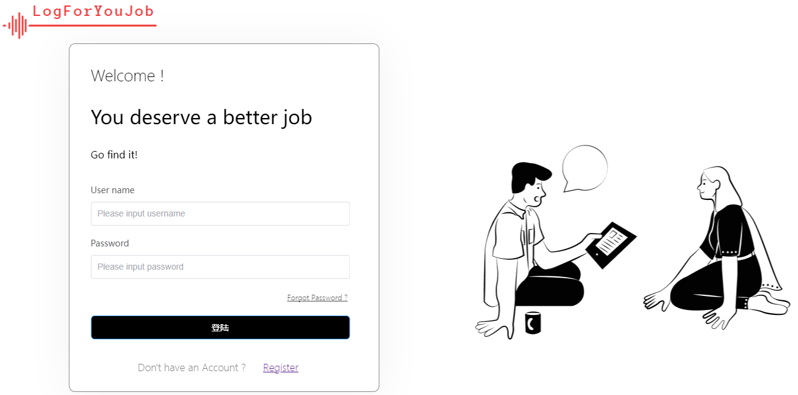
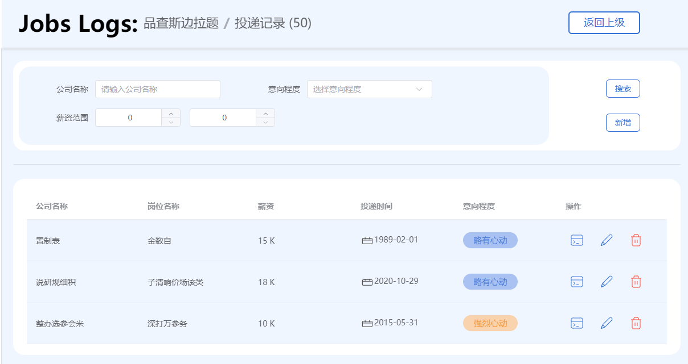

# LogForYourJob-Front

# 需求简述

为了方便在找工作时候记录投递的公司信息，方便对目标公司进行评价而做；工程使用**vue3**+**vite**构建，同时还使用**element-plus**,**pinia**,**vue-router**技术；

系统所有接口均为apifox的云端mock数据；登陆的账号密码随意输入

## 

# 页面

## 登陆



## 找工作记录


## 投递记录




# 工程启动

## Project Setup

```sh
npm install
```

### Compile and Hot-Reload for Development

```sh
npm run dev
```

### Compile and Minify for Production

```sh
npm run build
```
